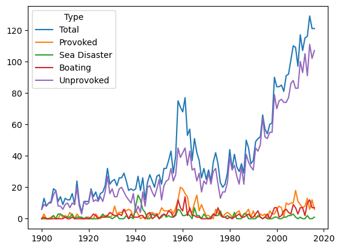
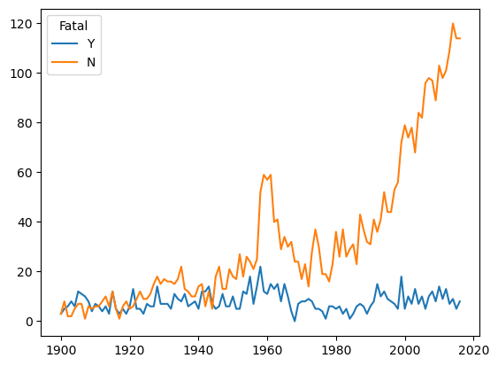

# Shark Attack Database Cleanup and Analysis | Project

## Introduction

The aim of this project is to use the tools we learned with Pandas to clean up the database, followed by an analysis of the cleaned data. The dataset contains an exhaustive list of shark attacks in all of history, together with several descriptor columns to set the scene.

## Cleaning

The process starts with a broad clean of all the strings in the dataset - stripping the whitespace the column names and string data.

Next, we look to remove as much useless data as possible. To do so, we identify all the rows with a significant amount of NaN values, which handily removes over 75% of the 'data'.

Notice that both the 'Year' and 'Case Number' columns are mostly intact and contain valuable date/sorting information. We can fix the few missing values with context and drop all the values that could easily be very unreliable, especially those before the year 1700. Since case number is a good intefying number, we reconstruct it using regex to extract the date values, as well as the scattered extra information stored within it. We can then drop all auxiliary columns.

We then go into the inner columns, such as Sex, Age and attack Type, cleaning up uncertain/undecidable/unknown values under a single label: 'Unknown'.

We can now export the new CSV file and perform our analysis on a copy of the table.

## Analysis

### Gender

By comparing our gender data to type of attack, we reach the following conclusions:
 
 - Men are far more likely to be in a position where they can be attacked by a shark
Women attack percentage of total:  11.1 %
Men attack percentage of total:  88.9 %

- Women are less likely to provoke a shark, and have more unprovoked accidents
Women provoked attack percentage:  4.1 %
Men provoked attack percentage:  10.8 %

- Men are more likely to have been in sea disasters and boating accidents
Women boating/disaster percentage:  3.2 %
Men boating/disaster percentage:  6.0 %

- Attacks against men are more likely to be fatal 
Women fatality rate:  18 %
Men fatality rate:  24 %

### Time Progression

By analysing the progress through the years, we find that:
- Sea disaster-related deaths are steadily declining
- However, amount of attacks reported is steadily increasing
- Amount of provoked attacks peaked in the mid 20th century but is decreasing
Notably, there is an increase in provoked attacks in the 1970s, but a decrease in total attacks. Both behaviours could be explained by the release and popularity of the Jaws movies (1975, 1978, ...).
- Fatal encounters are steadily decreasing

### To Dos...

- Correlation between type of activity (eg surfing) with gender and fatality
- Analysis by country
- Correlation between age, likelihood of attack, and fatality
- Analysis of type of shark, and correlation with fatality
- Time-of-attack analysis (eg Seasonal, Weekend, time of day)

## Conclusions

- Men are both more likely to be involved in reckless behaviour in the sea, and being involved in maritime disasters (likely due to wars and gender roles in sea work).
- Popular culture could have an effect on our interactions with sharks.
- The decrease in fatality rate could be explained by improved healthcare and education.

